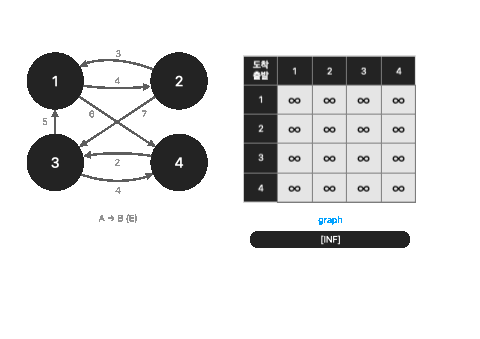

# Floyd-warshall(플로이드 워셜 알고리즘)

> 플로이드 워셜 알고리즘은 다익스트라 알고리즘과 다르게 **모든 지점에서 다른 모든 지점까지의 경로**를 구하는 알고리즘입니다.

플로이드 워셜 알고리즘은 이전 다익스트라 알고리즘과 다르게 매번 방문하지 않은 노드중에서 최단 거리를 갖는 노드를 찾을 필요 없습니다. 노드의 개수가 N개일 때, N번을 수행하면서 단계마다 $N^2$의 연산을 통해 **모든 경로를 고려하게** 됩니다. 결론적으로, **$O(N^3)$**의 시간 복잡도를 갖습니다. <mark style="color:orange;">**그래서 노드의 갯수가 적은 경우에 사용하는 편이 좋습니다.**</mark>

#### 플로이드 워셜과 다익스트라 알고리즘의 차이점

| 플로이드 워셜                | 다익스트라           |
| ---------------------- | --------------- |
| 2차원 리스트에 최단 거리 저장(N^2) | 1차원 리스트에 최단 거리저 |
| 다이나믹 프로그래밍             | 그리디 알고리즘        |

각 단계마 해당 노드를 거쳐 가는 경우를 갱신합니다. 예를 들어, 1번 노드에 대해 확인할 때 A -> 1 -> B 방식의 최단 거리가 2이고 A -> B가 3이라면 A-> 1 -> B 방식으로 갱신하면 됩니다.&#x20;

따라서, 현재 확인하는 노드를 제외하고 N-1개의 노드 중 서로 다른 (A,B) 쌍을 선택해 이후에 A-> 1 -> B 비용을 계산해 갱신하면 됩니다.

$$
D_{ab} = min(D_{ab}, D_{ak} + D_{kb})
$$

위 점화식을 해석하면 <mark style="color:blue;">**A에서 B로 가는 최소 비용과 A에서 K를 거쳐 B로 가는 비용을 비교해 더 작은 값을 갱신하는 것입니다.**</mark>

<figure><figcaption></figcaption></figure>

```python
INF = int(1e9)

n = int(input())
m = int(input())

graph = [[INF] * (n + 1) for _ in range(n+1)]

for a in range(1, n+1):
    for b in range(1, n+1):
        if a == b:
            graph[a][b] = 0


for _ in range(m):
    a, b, c = map(int, input().split())
    graph[a][b] = c

# 플로이드 워셜 알고리즘
for k in range(1, n+1):
    for a in range(1, n + 1):
        for b in range(1, n+1):
            graph[a][b] = min(graph[a][b], graph[a][k] + graph[k][b])

for a in range(1, n+1):
    for b in range(1, n+1):
        if graph[a][b] == INF:
            print("INF", end=" ")
        else:
            print(graph[a][b], end=" ")
    print()
```

* [비디오 링크](https://youtu.be/LTV59RJaHrk)
* 실전 문제&#x20;
