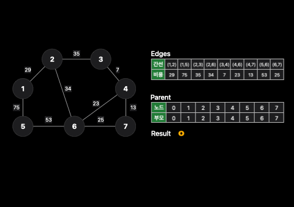

# Kruskal Algorithm(크루스칼 알고리즘)

크루스칼 알고리즘은 최소 비용으로 신장트리를 찾는 알고리즘입니다. 그런데 여기서, 신장 트리라는 개념이 아직 잡히지 않으셨을 텐데 짚고 넘어가봅시다.

### 신장트리 알고리즘

우선, 신장트리는 하나의 그래프가 있을 때 모든 노드를 포함하면서 사이클이 존재하지 않는 그래프를 말합니다. 네! 맞아요. 트리의 성립 조건이죠. 정리하자면,

* 모든 노드가 연결되어야 한다.
* 사이클이 존재하지 않는다.

그렇다면 아래와 같은 예시를 들어서, 모든 역을 연결할 때 최소한의 비용으로 연결하려면 어떤 알고리즘을 써야할지 생각해봅시다. 여기서 가장 최소한의 비용을 가지는 신장트리는 13일 것 입니다. 이렇게 **가장 최소한의 비용을 갖는 신장트리를 찾는 알고리**즘을 최소 신장트리 알고리즘이고 대표적으로 <mark style="color:orange;">**크루스칼 알고리즘(kruskal Algorithm)**</mark>이 있다는 것입니다.

* 용산 - 신용산
* 신용산 - 삼각지

<figure><figcaption></figcaption></figure>

구체적인 알고리즘 순서는 아래와 같습니다.

<figure><figcaption></figcaption></figure>

1. 간선 데이터 비용에 따라 오름차순 정렬을 한다. (35line)
2. 간선을 하나씩 확인하면서 **사이클 여부**를 확인한다. (42 line : 서로소 집합 알고리즘 참조)
   1. 만약 사이클이 발생하지 않는다면 신장 트리에 포함 시킨다.
   2. 만약 사이클이 발생한다면 신장 트리에 포함시키지 않는다.&#x20;
3. 총 최소 비용의 결과를 출력한다.

크루스칼 알고리즘의 시간 복잡도는 $O(ElogE)$를 갖는다. 이유는 가장 최악의 시간을 갖을 때가 정렬했을 때 입니다.


```python
# Union-Find 서로소 집합 알고리즘 참조
# FIND
def find(parent, x):
    if parent[x] != x:
        parent[x] = find(parent, parent[x])
    return parent[x]

# UNION
def union(parent, a, b):
    a = find(parent, a)
    b = find(parent, b)
    if a < b:
        parent[b] = a
    else :
        parent[a] = b

# 1. 노드의 개수와 간선 입력 받기
v, e = map(int, input().split())
parent = [0] * (v + 1) # 부모 테이블 초기화

# 2. 모든 간선을 담을 리스트와 최종 비용을 담을 변수
edges = []
result = 0

# 3. 부모 테이블 상에서, 부모를 자기 자신으로 초기화
for i in range(1, v + 1):
    parent[i] = i

# 4. 모든 간선 정보 입력받기
for _ in range(e):
    a, b, cost = map(int, input().split())
    # 비용순으로 정렬하기 위해 튜플의 첫번 째 원소를 비용으로 설정
    edges.append((cost, a, b))

# 5. 간선을 비용순으로 정렬
edges.sort()

# 간선을 하나씩 확인하면서
for edge in edges:
    cost, a, b = edge
    # 사이클이 발생하지 않는 경우에만 집합에 포함시킨다.
    if find(parent, a) != find(parent, b):
        union(parent, a, b)
        result += cost

# 전체 비용 출력
print(result)

print(edges)
```

