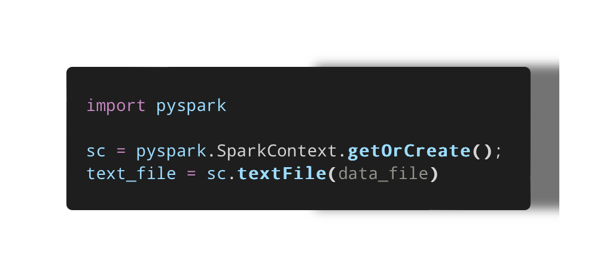

# RDD

## RDD 다시 정리

RDD(Resilient Distributed Dataset)는 스파크에서 <mark style="color:green;">**데이터 모델을 노드에 분산하여 저장하는  데이터 셋**</mark>입니다.  Lazy Evaluation과 Immutabity가 큰 특징입니다. RDD를 사용하면 짧은 코드로 쉽게 데이터를 변환시킬 수 있습니다.

### Spark Operation

Spark에는 `Transformation` 과 `Action`이라는 연산을 통해 데이터를 변환할 수 있습니다.

<figure><figcaption><p>Spark Operations</p></figcaption></figure>

위 연산들은 지금부터 천천히 사용하게 될 연산들입니다.

## 1. RDD를 생성하기

우선, RDD를 생성하기 전에 SparkContext 객체를 생성해야 합니다. 다음과 같이 SparkContext를 `getOrCreate()` 메서드를 통해 생성하고 RDD를 만들어봅시다.

<figure><figcaption></figcaption></figure>

`getOrCreate()` 를 통해 Spark Context 객체를 생성합니다. Spark Session을 이용하면 추가적으로 설정을 한 후 위 메서드로 객체를 생성할 수 있습니다.

객체의 `textFile()` 메서드를 통해 데이터 모델을 RDD로 변환합니다.

또는, `parallelize()` 를 통해 범위(range)나 콜렉션 타입들을 RDD로 변환할 수 있습니다.

## 2. Spark 연산

이후 만들어놓은 `text_file`를 Spark 연산을 통해 변환할 수 있습니다. Spark 연산에는 주로 `lambda` 함수가 많이 사용되는데 아래 예제를 보시면 어떻게 사용하면 되는지 알 수 있습니다.

```python
import pyspark
sc = pyspark.SparkContext.getOrCreate();
test_file = "file:///home/jovyan/work/sample/word.txt"

text_file = sc.textFile(test_file)
# ['hello world', 'hello world', 'hello world', 'hello world', 'hello world', 'hello world']

counts = text_file.flatMap(lambda line: line.split(" ")) \
                .map(lambda word: (word, 1)) \
                .reduceByKey(lambda a, b : a + b)

print(counts.collect())
[('world', 6), ('hello', 6)]
```

위 코드에서 `flatMap` 과 `map` `reduceByKey` 함수 와 다르게 `collect` 함수는 출력에 용도로 사용했는데요. 앞서 말한 세가지 함수는 <mark style="color:green;">Transformation 연산</mark>이기 때문에 실제로 연산은 하지 않고 RDD를 반환하는 역할을 하고 있습니다. 반면에 `collect()` 연산은 <mark style="color:green;">Action 연산</mark>이기 때문에 실제 값을 출력하거나 연산하는 역할을 하죠.

### Transformations

이제 RDD를 다루는데 자주 사용하는 연산들을 만나보겠습니다.

* `RDD.flatMap(f)`

RDD 각 원소에 함수(f)를 적용한 다음, <mark style="color:green;">**평평하게(Flattern)**</mark> 만들어서 결과를 반환합니다.

* `RDD.map(f)`

이전 Flattern과 다르게 평평하게 만들지 않고 함수를 적용하여 반환합니다.

> **flatMap()과 Map()의 차이**로는 평평게 만들어서 반환한다는 차이가 있습니다. 구체적으로 이 말은 **한 레벨로 합친다는 의미**로 생각하시면 됩니다. 아래 예시를 봅시다.
>
> ```python
> rdd = sc.parallelize([("blackpink","Lisa,Jennie,Jisoo,Rose"), ("solo","IU")])
> # result = rdd.map(lambda x: x[1].split(","))
> result = rdd.flatMap(lambda x: x[1].split(","))
> print(result.collect())
>
> # map
> [['Lisa', 'Jennie', 'Jisoo', 'Rose'], ['IU']]
> # flatMap
> ['Lisa', 'Jennie', 'Jisoo', 'Rose', 'IU']
> ```
>
> 위 결과처럼 `flatMap` 을 사용하면 더 많은 데이터도 추출할 수 있는 장점이 있겠죠.

* `RDD.reduceByKey(f)`

각 **키(key)를 중심으로 값을 병합(Merge)하는 역할**을 합니다. MapReduce에서 `combiner`와 비슷한 역할을 하며 Action 함수 이전에  원들을 합칩니다. `from operator import add` 함수로 많이 사용됩니다.

* `RDD.groupByKey()`

각 키(Key) 값들을 하나의 시퀀스 객체로 그룹핑합니다. 그래서 이후에 `mapValues()` 나 `reduceByKey()` `aggregateByKey()` 등의 함수를 사용하면 더 좋은 집계성능을 낼 수 있습니다.

* `RDD.join(other_rdd)`

다른 RDD의 키와 일치하는 **키 끼리 모든 값의 쌍을 만들어 RDD로 반환**합니다. `(k, v1)` 와 `(k, v2)`가 있으면 `(k, (v1, v2))` 로 반환하게 됩니다.

* `RDD.mapValues(f)`

`map` 함수와 비슷하게 함수를 적용합니다. 그러나 Values에게만 함수를 적용하는 것이죠.&#x20;

> **효율성**을 위해 만약 키가 아닌 <mark style="color:green;">**값만 필요해 사용하는 경우**</mark> `map` 대신에 `mapValues` 아니면 `flatMapValues` 를 사용하면 훨씬 효율적일 것입니다.

* `RDD.filter(f)`

**조건자(predicate)에 만족하는 요소들만 포함**한 새로운 RDD를 반환하는 필터링 역할 함수입니다.

```python
filtered = line.filter(lambda x: "NA"  not in x[1])
```

* `RDD.sortByKey(ascending=True)`

(Key, Value) 쌍으로 이루어진 RDD를 정렬하는 함수입니다. `keyfunc` 를 옵션으로 추가하여 함수를 넣을 수 있습니다.

### Actions

* `RDD.collect()`

RDD의 모든 요소를 <mark style="color:green;">**List 형태**</mark>로 반환합니다.

* `RDD.countByValue()`

RDD 모든 요소들의 값 개수를 <mark style="color:green;">**Dictonary 형태(Value, Count)**</mark>로 반환하는 메소드입니다. `defaultdict` 자료형을 가집니다.


### 참고


프레임워크는 공식 문서를 참고하면 편해요.


