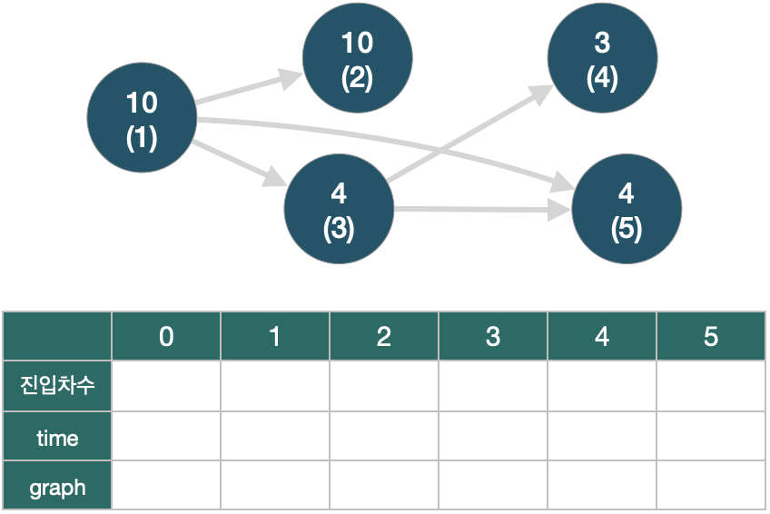

# RDD 데이터 구조

## RDD가 무엇인가요?

<figure><figcaption></figcaption></figure>

스파크에서 가장 중요한 역할을 하는 RDD입니다.

RDD는 <mark style="color:blue;">**여러개 노드에 분산되어 있는 데이터셋**</mark>입니다. 그래서 탄력적 분산 데이터셋(Resilient  Distributed Dataset)이라고 합니다. RDD는 Spark에서 가장 처음 도입된 데이터 구조이기 때문에 Low-Level 한 데이터라고 부릅니다.

RDD의 큰 특징으로 다음과 같습니다.

* **Lazy Evaluation** : 파이썬의 Generator 처럼 필요할 때마다 액션을 실행하는 녀석입니다.  액션을 실행하기 전까지는 연산을 하지 않아요. 그래서 게으른 연산이라고 합니다.
* **Immutablity** : 처리하는 도중에 데이터는 바뀌지가 않기 때문에 노드가 망가져도 다시 복원을 할 수 있습니다. 그래서 탄력적입니다.
* **abstract :** 분산 처리이기 때문에 데이터가 흩어져 있어도 하나의 파일 인 것처럼 사용합니다.

> **복원한다는 말이 정확히 무슨말인가요?**
>
> RDD의 변경 프로세스는 **DAG(Directed Acyclic Graph)** 형태를 하고 있습니다.
>
> DAG 그래프는 노드간의 순환이 없고 일정한 방향성을 가는 형태 입니다. RDD 연산과정에서 데이터가 손실이 되었을 경우, DAG 그래프를 복귀하여 다시 계산해서 복구를 할 수 있습니다.

### RDD를 생성해봅시다.&#x20;

```python
import pyspark

sc = pyspark.SparkContext.getOrCreate(); # 1

rdd = sc.parallelize(range(1000)) # 2
rdd.taskSample(False, 5) # 0~1000까지 데이터 중 5개를 추출합니다.

rdd = sc.textFile(data_file) # 3

```

1. 우선, RDD를 생성하기 전에 SparkContext 객체를 생성해야 합니다. 다음과 같이 SparkContext를 `getOrCreate()` 메서드를 통해 생성하고 RDD를 만들어봅시다.
2. RDD를 생성합니다.
   1. `parallelize()` 를 통해 범위(range)나 콜렉션 타입들을 RDD로 변환할 수 있습니다.
   2. 객체의 `textFile()` 메서드를 통해 데이터 모델을 RDD로 변환합니다.

앞에서 설명했듯이,  RDD는 불변한 분배 객체이기 때문에 데이터를 변경할 수 없습니다.


## RDD Operation

Spark에는 `Transformation` 과 `Action`이라는 연산을 통해 데이터를 변환할 수 있습니다.

* **Transformation** : 바꾼다는 의미가 아니라 **새로  RDD를 생성한다는 의미가 강합니다.** 이 작업을 수행할 때마다 연산 기록이 남게 됩니다.&#x20;
* **Action** : 실제로 메모리에 올려 연산을 수행하는 작업입니다.

<figure><figcaption><p>Spark Operations</p></figcaption></figure>

이후 만들어놓은 `text_file`를 Spark 연산을 통해 변환할 수 있습니다.&#x20;

Spark 연산에는 _주로 `lambda` 함수_가 많이 사용되는데 아래 예제를 보시면 어떻게 사용하면 되는지 알 수 있습니다.

```python
import pyspark
sc = pyspark.SparkContext.getOrCreate();
test_file = "file:///home/jovyan/work/sample/word.txt"

text_file = sc.textFile(test_file)
# ['hello world', 'hello world', 'hello world', 'hello world', 'hello world', 'hello world']

counts = text_file.flatMap(lambda line: line.split(" ")) \
                .map(lambda word: (word, 1)) \
                .reduceByKey(lambda a, b : a + b)

print(counts.collect())
[('world', 6), ('hello', 6)]
```

위 코드에서 `flatMap` 과 `map` `reduceByKey` 함수 와 다르게 `collect` 함수는 출력의 용도로 사용했는데요. 앞서 말한 세가지 함수는 <mark style="color:purple;">**Transformation 연산**</mark>이기 때문에 실제로 연산은 하지 않고 RDD를 반환하는 역할을 하고 있습니다. 반면에 `collect()` 연산은 <mark style="color:purple;">**Action 연산**</mark>이기 때문에 실제 값을 연산하는 역할을 하죠.

* <mark style="color:purple;">**즉, RDD는 Action 연산을 하기 전까지 Transformation연산으로 계획만 해놓고 실질적인 연산을 하지 않습니다.**</mark>

### Transformations

이제 RDD를 다루는데 자주 사용하는 연산들을 만나보겠습니다.

* `RDD.flatMap(f)`

RDD 각 원소에 함수(f)를 적용한 다음, <mark style="color:green;">**평평하게(Flattern)**</mark> 만들어서 결과를 반환합니다.

* `RDD.map(f)`

이전 Flattern과 다르게 평평하게 만들지 않고 함수를 적용하여 반환합니다.

> **flatMap()과 Map()의 차이**로는 평평게 만들어서 반환한다는 차이가 있습니다. 구체적으로 이 말은 **한 레벨로 합친다는 의미**로 생각하시면 됩니다. 아래 예시를 봅시다.
>
> ```python
> rdd = sc.parallelize([("blackpink","Lisa,Jennie,Jisoo,Rose"), ("solo","IU")])
> # result = rdd.map(lambda x: x[1].split(","))
> result = rdd.flatMap(lambda x: x[1].split(","))
> print(result.collect())
>
> # map
> [['Lisa', 'Jennie', 'Jisoo', 'Rose'], ['IU']]
> # flatMap
> ['Lisa', 'Jennie', 'Jisoo', 'Rose', 'IU']
> ```
>
> 위 결과처럼 `flatMap` 을 사용하면 더 많은 데이터도 추출할 수 있는 장점이 있겠죠.

* `RDD.reduceByKey(f)`

각 **키(key)를 중심으로 값을 병합(Merge)하는 역할**을 합니다. MapReduce에서 `combiner`와 비슷한 역할을 하며 Action 함수 이전에  원들을 합칩니다. `from operator import add` 함수로 많이 사용됩니다.

* `RDD.groupByKey()`

각 키(Key) 값들을 하나의 시퀀스 객체로 그룹핑합니다. 그래서 이후에 `mapValues()` 나 `reduceByKey()` `aggregateByKey()` 등의 함수를 사용하면 더 좋은 집계성능을 낼 수 있습니다.

* `RDD.join(other_rdd)`

다른 RDD의 키와 일치하는 **키 끼리 모든 값의 쌍을 만들어 RDD로 반환**합니다. `(k, v1)` 와 `(k, v2)`가 있으면 `(k, (v1, v2))` 로 반환하게 됩니다.

* `RDD.mapValues(f)`

`map` 함수와 비슷하게 함수를 적용합니다. 그러나 Values에게만 함수를 적용하는 것이죠.&#x20;

> **효율성**을 위해 만약 키가 아닌 <mark style="color:green;">**값만 필요해 사용하는 경우**</mark> `map` 대신에 `mapValues` 아니면 `flatMapValues` 를 사용하면 훨씬 효율적일 것입니다.

* `RDD.filter(f)`

**조건자(predicate)에 만족하는 요소들만 포함**한 새로운 RDD를 반환하는 필터링 역할 함수입니다.

```python
filtered = line.filter(lambda x: "NA"  not in x[1])
```

* `RDD.sortByKey(ascending=True)`

(Key, Value) 쌍으로 이루어진 RDD를 정렬하는 함수입니다. `keyfunc` 를 옵션으로 추가하여 함수를 넣을 수 있습니다.

### Actions

* `RDD.collect()`

RDD의 모든 요소를 <mark style="color:green;">**List 형태**</mark>로 반환합니다.

* `RDD.countByValue()`

RDD 모든 요소들의 값 개수를 <mark style="color:green;">**Dictonary 형태(Value, Count)**</mark>로 반환하는 메소드입니다. `defaultdict` 자료형을 가집니다.


## 종속성(Dependency)

Spark의 Transformation에는 넓은 종속성과 좁은 종속성이 존재합니다.

<figure><figcaption></figcaption></figure>

#### 좁은 종속성 (narrow dependency)

단순하고 한정적인 종속성을 가진다. **최대 하나의 파티션을 가지며 임의의 데이터를 요구**할 수 있다. (1:1 대응)

e.g. `map()` `mapPartition()` `flatMap()` `filter()` `union()`

#### 넓은 종속성 (Wide dependency)

<mark style="color:orange;">**특별한 방법에 따라 데이터를 요구**</mark>할 수 있다. 예를 들어, **키의 값**에 따라 데이터를 요구한다. (파티션마다 어떤 키가 있는지 알아야하기 때문에 키의 재분포, <mark style="color:orange;">**셔플링이 필요한 이유**</mark>) 만약, 어떤 특정한 방법으로 파티션이 되어 있다는 것을 알고 있다면 셔플링을 하지 않는다. (N:1 대)

`groupByKey()` `aggregateByKey()` `sortByKey()` `reduceByKey()` `aggregate()` `join()` `repartitions()`

> #### Shuffling이란?
>
> 셔플링은 노드 사이에서 데이터가 메소드로 인해 이동하는 것을 말합니다. 이동하는 데이터가 많으면 Spark 성능에 큰 영향을 끼치기 때문에(응답시간이 늘어납니다.) Shuffling이 되도록이면 적은 방향으로 구성해야 합니다.

결론적으로, 부모 RDD를 구성하는 파티션이 여러 개의 자식 RDD 파티션과 관계를 맺고 있으면 **넓은 의존성**을 갖고 있고 그 반대이면 **좁은 의존성**을 갖고 있다고 말할 수 있습니다.


### 참고

* [https://brocess.tistory.com/187](https://brocess.tistory.com/187)


프레임워크는 공식 문서를 참고하면 편해요.


