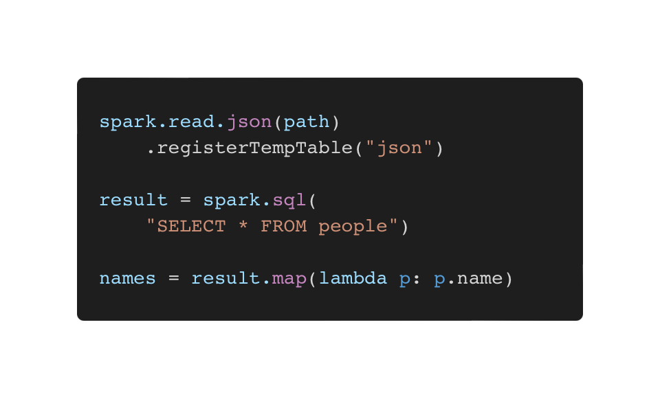

# Spark SQL

## Spark SQL

* **Dataframe**을 이용하여 Query하여 데이터를 처리할 수 있습니다.

<figure><figcaption></figcaption></figure>

1. **Hive Integration** : Hadoop에서 사용했던 Hive Query 툴을 Spark SQL에서 사용이 가능합니다.
2. **Standard Connectivity** : BI 툴에서 SparkSQL로 Query를 보낼 수 있습니다.
3. **Industry Trend** : 현재 RDD보다 Dataframe을 더 많이 사용하는 추세

> #### RDD보다 Dataframe을 더 선호하는 이유?
>
> DataFrame은 RDD에 반해 Column과 Row로 이루어진 <mark style="color:purple;">**구조화된 데이터(관계형 데이터)**</mark>로 사람들이 쉽게 데이터를 처리할 수 있기 때문입니다. RDD는 구조화가 되어있지 않고 Low-Level의 API를 제공하기 때문에 불편한 감이 있겠죠. 그러나 RDD는 쓰면 안된다는 것은 아닙니다. RDD는 주로 비 구조화된 데이터를 사용하거나 최적화나 스키마를 굳이 따지고 싶지 않다거나 함수형 프로그래밍을 사용하고 싶을 때 RDD를 사용합니다.&#x20;

| RDD                           | Structured Data(DataFrame)                  |
| ----------------------------- | ------------------------------------------- |
| 튜플로 이루어진 비 구조화 데이터            | 데이터 구조를 알고 있어 **어떤 테스크를 수행할 건지 정의**만 하면 된다. |
| Map,flatMap,filter로 유저의 함수 수행 | **최적화도 자동**으로 할 수 있음                        |
| Spark Core                    | Spark SQL                                   |
| SparkContext                  | SparkSession                                |

## DataFrame

* `Schema` 를 만들거나 JSON,CSV,Hive,Avro,PArquet, ORC등을 읽거나 작성할 수 있습니다.
* Mllib 이나 Spark Streaming 같은 다른 모듈과 사용하기 편합니다.
* JDBC나 ODBC,  Tabluau 툴과 연결할 수 있습니다.

> #### `RDD` 에서 `DataFrame` 으로 변환 하는 방법이 있긴 합니다.
>
> `rdd = df.rdd.map(tuple)` 을 사용하면 변환을 할 수 있으나 덜 사용하는 편이 좋다고 합니다.

```python
from pyspark.sql import(
    Row,
    SparkSession)

def parse_line(line: str):
    fields = line.split('|') # |
    return Row(
        name=str(fields[0]),
        country=str(fields[1]),
        email=str(fields[2]),
        compensation=int(fields[3]))

spark = SparkSession.builder.appName("SparkSQL").getOrCreate()
lines = spark.sparkContext.textFile("file:///home/jovyan/work/sample/income.txt")
income_data = lines.map(parse_line)

schema_income = spark.createDataFrame(data=income_data)
schema_income.createOrReplaceTempView("income")
```

#### [SparkSession.builder](https://spark.apache.org/docs/3.1.2/api/python/reference/api/pyspark.sql.SparkSession.html?highlight=sparksession)

RDD를 생성하기 위해 우선 SparkContext 객체를 생성하는 작업을 진행하였습니다. 객체를 생성하기 전에 SQL에서 재공하는 `SparkSession` 을 통해 Dataset이나 DataFrameAPI를 사용할 수 있습니다.

#### SparkSession.Row(Field=Value)

**DataFrame의 Row 열을 만드는 클래스**입니다. 이 두가지 작업이 끝나면 데이터프레임을 만들 수 있습니다. SparkSession을 통해 데이터프레임을 만들 수 있습니다.&#x20;

#### [Spark.Session.createDataFrame(data=data, ...)](https://spark.apache.org/docs/3.1.2/api/python/reference/api/pyspark.sql.SparkSession.createDataFrame.html?highlight=createdataframe)

RDD나 List 또는 Pandas의 DataFrame으로 **DataFrame을 생성**할 수 있습니다. `DataFrame.createOrReplaceTempView(name)`으로 임시적인 테이블 명칭을 지정할 수 있습니다. 이후에, 테이블을 통해 SQL 쿼리를 사용할 수 있겠죠!

만들어진 DataFrame은 **`.show()`** 라는 메소드를 통해 나타낼 수 있습니다.

### SQL 사용하기

<pre class="language-python"><code class="lang-python">from pyspark.sql.functions import col, asc, desc 
# column name, ascending order, descending order

<strong>medium_income_df = spark.sql(
</strong>    """
     SELECT *
     FROM income
     WHERE compensation >= 70000 AND compensation &#x3C;= 100000
    """)
medium_income_df.show()

# for income_data in medium_income_df.collect():
#     print(income_data.name)

schema_income.groupBy("country").count().orderBy(col("count").desc()).show()
</code></pre>

## CSV 파일 불러오기

```python
from pyspark.sql import SparkSession
from pyspark.sql.functions import (avg, col, round as rnd)

spark = SparkSession.builder.appName("sql_import_csv").getOrCreate()
csv_file_path = "file:///home/jovyan/work/sample/age.csv"

data = spark.read.option("header", "True")\ # True, 첫 Row를 헤더처리합니다.
            .option("inferSchema", "True")\ # True, Field의 자료형을 추론합니다.
            .csv(csv_file_path) # csv 파일을 읽어옵니다.

# printSchema : 스키마를 보여주는 함수
data.printSchema()
```

위 코드와 비슷하지만 `csv` 파일을 Dataframe으로 읽어올 때 SparkSession의 **`read`** 라는 메소드를 사용합니다. `read` 함수에는 여러가지 `option`을 통해 Dataframe으로 읽어올 수 있습니다.&#x20;

불러온 DataFrame을 [`.select()` `.avg()` `groupBy()` `agg(GroupBy연산)`](https://spark.apache.org/docs/3.1.2/api/python/reference/api/pyspark.sql.DataFrame.html?highlight=dataframe#pyspark.sql.DataFrame) 을 통해 여러가지 연산을 할 수 있습니다.

> #### 새로운 Column을 만들어내는 [`withColumn(colName, col)`](https://spark.apache.org/docs/3.1.1/api/python/reference/api/pyspark.sql.DataFrame.withColumn.html?highlight=.withcolumn#pyspark.sql.DataFrame.withColumn) 함수
>
> withColumn 함수를 이용해 새로운 컬럼이 더하거나 존재하는 컬럼을 수정해 Dataframe을 반환합니다.


### functions

pyspark의 sql은 다양한 함수들을 사용할 수 있어요.

* **`round(col, 소수점)`** :  소수점 반올림을 위한 함수
* **`sum(col)`** : 합계를 구하는 함수
* **`explode(col)`** : **Transpose**와 같은 기능으로 col과 row를 치환할 수 있다.

```python
df = spark.createDataFrame([
        Row(a=1,
            intlist=[1,2,3],
            mapfield={"a": "b"}
           )])

df.show()
df.select(functions.explode(df.intlist).alias("anInt")).show()
# output: [Row(anInt=1), Row(anInt=2), Row(anInt=3)]
```

<figure><figcaption></figcaption></figure>

* **`split(str, pattern, limit=-1)`** : **문자열 데이터를 패턴에 적용시켜 분할** 하여 리스트로 만들 수 있다. 만약, 한번만 분할하고 싶으면 `limit=1` 로 설정하면 된다.

```python
# functions.split(str, pattern, limit=-1)
# Splits str around matches of the given pattern.
df = spark.createDataFrame([
        Row(word="hello world and pyspark")])
df.select(functions.split(df.word, ' ').alias("word")).show()
```

* **`udf(function)`** : 사용자 정의 함수를 만들어낼 수 있는 함수입니다.&#x20;

```python
def get_occupation_name(occupation_id:str) -> str:
    return occupation_dict.value[occupation_id]
    
occupation_lookup_udf = f.udf(get_occupation_name)
# lambda 함수를 바로 사용해도 됩니다.
```

### StructType

StructType에 포함된 `StructField` 를 반복적으로 적용할 수 있는 기능입니다. **만약 데이터프레임에 헤더가 없는 경우 `Field`를 만들어주는 기능**을 하고 있습니다.

```python
from pyspark.sql import (
    SparkSession,
    functions as f,
    Row,
    types as t
)
```

먼저 `types` 라는 모듈을 불러옵니다.

```python
# types.StructField(name, dataType, nullable=True, metadata=None)
table_schema = t.StructType([
    t.StructField("country", t.StringType(), True),
    t.StructField("temperature", t.FloatType(), True),
    t.StructField("observed_date", t.StringType(), True)])

csv_file_path = "file:///home/jovyan/work/sample/temp_with_date.csv"
df = spark.read.schema(table_schema).csv(csv_file_path)
```

StructType 내에 StructField를 구성하여 Schema를 만들어줍니다. 그런 다음, sparkSession을 통해 Schema와 데이터가 담긴 데이터파일(csv)을 읽어들이면 됩니다.


#### 참고



* [https://spidyweb.tistory.com/326](https://spidyweb.tistory.com/326)
